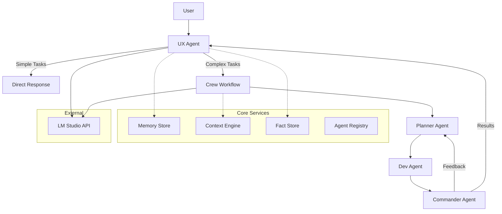

# Architecture Overview

## System Design

Crew Assistant is designed as a modular, extensible multi-agent orchestration platform that runs entirely locally. The architecture emphasizes separation of concerns, plugin-based extensibility, and privacy-first design.



## Core Components

### 1. Agent System

#### Agent Registry (`core/agent_registry.py`)
- **Purpose**: Dynamic agent discovery and registration
- **Pattern**: Plugin-based architecture using module introspection
- **Extensibility**: New agents automatically discovered if they follow the interface

#### Base Agent Structure
Each agent inherits from CrewAI's base `Agent` class and defines:
- **Role**: Agent's primary responsibility
- **Goal**: What the agent aims to achieve
- **Backstory**: Context for the agent's behavior
- **Tools**: Available tools/functions the agent can use
- **Delegation**: Whether the agent can delegate to others

#### Current Agents

1. **UX Agent** (`agents/ux.py`)
   - Entry point for all user interactions
   - Evaluates task complexity
   - Handles simple queries directly
   - Delegates complex tasks to crew workflow

2. **Planner Agent** (`agents/planner.py`)
   - Strategic task decomposition
   - Creates actionable subtasks
   - Considers dependencies and ordering

3. **Dev Agent** (`agents/dev.py`)
   - Technical implementation
   - Code generation and analysis
   - Tool usage for file operations

4. **Reviewer Agent** (`agents/reviewer.py`)
   - Quality assessment with numeric ratings (1-10 scale)
   - Evaluates completeness, quality, clarity, feasibility, alignment
   - Provides comprehensive feedback without blocking workflow execution

### 2. Context Engine (`core/context_engine/`)

The context engine manages stateful information across agent interactions:

#### Memory Store (`memory_store.py`)
- **Storage**: JSON file-based persistence
- **Structure**: Timestamped entries with metadata
- **Capacity**: Configurable maximum entries (default 1000)
- **Archive**: Automatic archival of old memories

#### Fact Store (`fact_store.py`)
- **Purpose**: Extracted knowledge from conversations
- **Format**: Key-value pairs with metadata
- **Learning**: Facts extracted and stored for future reference

#### Context Router (`context_router.py`)
- **Role**: Determines relevant context for each agent
- **Strategy**: Agent-specific context filtering
- **Injection**: Seamlessly adds context to agent prompts

#### Context Types (`context_types.py`)
- **Definitions**: TypedDict structures for type safety
- **Standardization**: Consistent context formats

### 3. Configuration System

#### Settings (`crew_assistant/config.py`)
- **Framework**: Pydantic-based configuration
- **Environment**: `.env` file support
- **Validation**: Type checking and constraints
- **Defaults**: Sensible defaults for all settings

Key configurations:
- API endpoints and credentials
- Model selection
- Directory paths
- Memory limits
- Timeouts

### 4. Utilities

#### Model Selector (`utils/model_selector.py`)
- **Interactive**: CLI-based model selection
- **Compatibility**: Checks model capabilities
- **Validation**: Ensures selected model meets requirements

#### UX Shell (`utils/ux_shell.py`)
- **REPL**: Read-Eval-Print Loop for direct interaction
- **Memory**: Integrates with memory store
- **Logging**: Session history in `crew_runs/`

#### Fact Learning (`utils/fact_learning.py`)
- **Extraction**: Identifies facts from conversations
- **Storage**: Persists to fact store
- **Context**: Builds context from learned facts

## Data Flow

### 1. User Input Flow
```
User Input → UX Agent → Complexity Analysis → Route Decision
                                                 ↓
                                          Simple: Direct Response
                                          Complex: Crew Workflow
```

### 2. Crew Workflow
```
Task → Planner → Subtasks → Dev → Implementation → Reviewer → Quality Ratings
                                                       ↓
                                              Analytics Collection (Non-blocking)
```

### 3. Memory Flow
```
Conversation → Memory Store → Archive (when full)
      ↓
Fact Extraction → Fact Store → Context Building
```

## Storage Architecture

### Directory Structure
```
memory/
├── memory_store/
│   └── memories.json       # Active memories
├── facts/
│   └── facts.json         # Learned facts
└── archive/
    └── memories_YYYYMMDD_HHMMSS.json  # Archived memories

deliverables/
└── [session_id]/          # Crew workflow outputs

crew_runs/
└── ux_shell_YYYYMMDD_HHMMSS.json  # UX shell logs

snapshots/
└── [timestamp]_snapshot.json  # Workflow snapshots
```

### Persistence Strategy
- **JSON-based**: Human-readable, debuggable storage
- **File-per-concept**: Separate files for memories, facts
- **Automatic archival**: Prevents unbounded growth
- **Session isolation**: Each run has its own output directory

## Extension Points

### 1. Adding New Agents
1. Create new file in `agents/` directory
2. Define agent class with required attributes
3. Agent automatically discovered by registry

Example:
```python
from crewai import Agent

analyst = Agent(
    role="Data Analyst",
    goal="Analyze data and provide insights",
    backstory="Expert in data analysis and visualization",
    tools=[],  # Add relevant tools
    verbose=True,
    allow_delegation=False
)
```

### 2. Adding New Tools
1. Implement tool following CrewAI tool interface
2. Add to agent's tool list
3. Tools can be shared across agents

### 3. Custom Context Strategies
1. Extend `ContextRouter` class
2. Implement custom filtering logic
3. Register new strategy in configuration

### 4. Storage Backends
1. Implement storage interface
2. Replace JSON with database (SQLite, PostgreSQL)
3. Add vector storage for semantic search

## Security Architecture

### API Security
- **Local-only**: All LLM calls to localhost
- **No telemetry**: No external API calls
- **Environment isolation**: Secrets in `.env` file

### Data Security
- **Local storage**: All data stored locally
- **No cloud sync**: Privacy-first design
- **User control**: Full control over data lifecycle

## Performance Considerations

### Current Limitations
1. **Sequential processing**: Agents run sequentially
2. **File-based storage**: O(n) search complexity
3. **Memory limits**: Fixed maximum entries

### Optimization Opportunities
1. **Async operations**: Parallel agent execution
2. **Database backend**: Indexed storage for faster queries
3. **Vector embeddings**: Semantic memory search
4. **Caching**: Response caching for common queries

## Testing Architecture

### Test Categories
1. **Unit Tests**: Individual component testing
2. **Integration Tests**: Component interaction testing
3. **System Tests**: End-to-end workflow testing

### Test Infrastructure
- **Framework**: Pytest with fixtures
- **Mocking**: External dependencies mocked
- **Isolation**: Tests use temporary directories
- **Coverage**: Configured but needs implementation

## Future Architecture Enhancements

### Phase 1: Foundation (Current)
- ✅ Basic multi-agent system
- ✅ Memory persistence
- ✅ Local LLM integration
- ⏳ Comprehensive testing
- ⏳ Type safety throughout

### Phase 2: Enhancement
- [ ] Async agent execution
- [ ] Vector memory search
- [ ] Tool marketplace
- [ ] Web UI dashboard
- [ ] Agent communication protocol

### Phase 3: Scale
- [ ] Distributed agent execution
- [ ] Multi-user support
- [ ] Agent marketplace
- [ ] Cloud-optional deployment
- [ ] Real-time collaboration

## Design Principles

1. **Local-First**: All processing happens locally
2. **Privacy-Focused**: No data leaves the machine
3. **Extensible**: Easy to add new agents and tools
4. **Modular**: Clear separation of concerns
5. **Testable**: Designed for comprehensive testing
6. **Type-Safe**: Progressive type safety adoption
7. **User-Centric**: Focus on developer experience